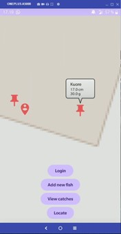

# Laaja harjoitustyö – FishLogger

## MainActivity

Tein sovelluksen, johon käyttäjä voi kirjata saamiaan kalasaaliita. Ensiasennuksen yhteydessä tulee lupakyselyt sijaintiin, kameraan ja laitteen tallennustilaan. Sen jälkeen käyttäjä ohjautuu Firebasen sähköpostiautentikointiin, sillä tiedot saaliista tallentuvat Firestore-tietokantaan. 

Onnistuneen kirjautumisen jälkeen käyttäjällä on edessään osmdroidilla toteutettu karttanäkymä ja neljä nappulaa. Huomiona, että koodissa on poistettu osmdroidin zoom-nappulat, sillä ne olivat omien nappuloiden tiellä. Emulaattoritestausta varten kannattaa kommentoida `onCreate()`-funktiosta zoom-napit poistava rivi. Kartalla näkyvät pinneillä logitetut saaliit ja käyttäjän oma sijainti. Käyttäjän pinni on erilainen kuin kalojen. Kalan pinniä painamalla näkyy infokuplassa saaliin laji, pituus ja paino.
Tällä hetkellä sovellus alkaa heti hakea käyttäjän sijaintia, mikäli sijainti on päällä, mutta näkymä ei itsestään keskity tuohon pisteeseen, vaan alimmainen Locate-nappi keskittää näkymän ja asettaa kohtuullisen zoomin.
     
Ylin nappi on Login. Tämä on siis vain käyttäjän vaihtamista varten. Erillistä uloskirjautumisnappia en tähän lopputyöhön tehnyt, sillä ei ole järkevää käyttää koko sovellusta, mikäli ei halua omia logitettuja saaliitaan nähdä. Pelkän kartan käyttöön on olemassa paljon parempia sovelluksia.

## AddFishActivity

Toiseksi ylin Add new fish-nappi avaa uuden activityn uuden kalan lisäämistä varten. Tietueita on viisi: päivämäärä (ja kellonaika), sijainti, laji, pituus ja paino.

Päivämäärä hakee automaattisesti activityn avaamishetken sekunnilleen, mutta näyttää käyttäjälle vain minuutin tarkkuuden visuaalisen siisteyden vuoksi. Tarkka aika piti alkuun tallentaa siksi, että käytin ensin `Fish`-objektin uniikkina ID:nä tuota kellonaikaa, mutta päädyin lopulta toiseen ratkaisuun. (ChatGPT paljasti, että valmis UUID-luokka on olemassa…)

Sijainti haetaan myös automaattisesti, kunhan se on saatavilla. Tähän on koodissa olemassa oma interfacensa `OnLocationAvailableListener`, joka asettaa tiedon kenttään, kun se on saatavilla. Latitude ja longitude arvot saattavat vaihdella, sillä en halunnut lopettaa sijainnin hakua heti ensimmäiseen saatavilla olevaan sijaintiin, koska se on yleensä aika summittainen. Oletan, että kun sijainnin antaa päivittyä niin kauan kuin käyttäjä syöttää muita tietoja itse, on lopulta ehditty saada tarkempi sijaintitieto. 

Laji valitaan omasta alasvetovalikosta. Tämä mm. siksi, jotta vältytään kirjoitusasun tarkistuksilta, kun ViewHolderin `bind()`-funktiossa asetetaan drawable lajin mukaan ImageViewiin. Tällä hetkellä lajeja on 10, mutta se riittänee tällaiseen ”demosoftaan”.

Pituus ja paino syötetään numeroina. Kehotus on käyttää senttimetrejä ja grammoja yksiköinä.

## CameraActivity

Kun kalan tiedot ovat valmiit, sen voi tallentaa Save-nappulasta. Tällöin ilmestyy dialogi, joka kysyy, haluaako käyttäjä lisätä saaliistaan kuvan, ja samalla kentät taustalla nollaantuvat. Mikäli kuvaa ei haluta, on kalan tallennus valmis ja näkymä säilyy tässä activityssä valmiina seuraavan kalan kirjaamista varten. Jos valitsee, että kuva otetaan, aukeaa uusi activity, jossa on vain neliön mallinen esikatseluruutu kuvaamista varten, sekä nappi kuvan ottamista varten. Kun kuva on onnistuneesti otettu, kamera-activity sulkeutuu itsestään. Ennen kuvan ottamista activityn voi myös sulkea ongelmitta menemällä takaisin edelliseen näkymään, mutta tällöin kuvaa ei voi enää jälkikäteen lisätä.

Mahdollinen saaliista itse otettu kuva tallentuu tällä hetkellä laitteen omaan galleriaan. Kuvan olisi voinut saada myös Firestoreen, mutta tiedostokoko olisi täytynyt olla riittävän pieni. Harkitsin hetken Firebasen Storagea kuvia varten, mutta tulin siihen tulokseen, etten nyt tämän kurssin puitteissa ala siihen. Selvittelin alustavasti kyllä periaatetta, jolla homma toimisi. Kuvan lataamisessa pilveen olisi oikeaoppisesti otettava huomioon mm. se mitä tehdään, jos lataus epäonnistuu syystä tai toisesta. Muutenkin koko latausprosessin rakentaminen vaatii melko paljon ns. boiler plate-koodia. Kuvan hakeminen hoituisi luultavasti helpohkosti käyttämällä Glideä, jota käytin muutenkin kuvan asettamisessa ImageViewiin, jotta ei tarvitse laskea rotaatiomatriisilla kuvan oikeaa asentoa.

</img>

## FishListActivity

MainActivityn viimeinen View catches-nappi avaa uuden activityn, jossa on RecyclerView’ssä kaikki käyttäjän logittamat saaliit tietoineen. Kalan kuvaa painamalla aukeaa kuva isompana dialogiin. Muualle painamalla aukeaa edellä kuvailtu kalan tietojen lisäämiseen tarkoitettu AddFishActivity, mutta nyt siinä näkyy painetun kalan tiedot. Niihin on mahdollista tehdä muutoksia, ja jos muutokset haluaa tallentaa, voi niin tehdä painamalla Save-nappulaa. Napista ajettavassa funktiossa on tarkistus sille, ollaanko lisäämässä uutta kalaa vai editoimassa vanhaa. Save-napin painaminen avaa vielä varmistusta kysyvän dialogin.

</img>
</img>
</img>
</img>

RecyclerView-näkymästä voi poistaa kalan painamalla sitä pitkään. Tällöin aukeaa dialogi, joka vielä kysyy varmistuksen.

*Huomio: kalojen kuvituskuvat on varastettu sivulta [https://ahven.net/kalastus/yleisimmat-kalalajit/](https://ahven.net/kalastus/yleisimmat-kalalajit/) ja käsitelty GIMP:ssä.*

## Arkkitehtuurista

</img>
 
Yllä oleva luokkakaavio on generoitu automaattisesti Java-lähdekoodista Android Studion plugineilla PlantUML Integration ja PlantUML Parser. Kuva on svg-muodossa, joten zoomata kannattaa. En ole tehnyt luokkakaavioita juuri ollenkaan. Tämän ja ajanpuutteen vuoksi jätin kaavion automaation hoidettavaksi. Kuitenkin olen sitä mieltä, ettei se taida kuvastaa ihan kaikkia luokkien keskinäisiä suhteita. Riittänee yleiskäsityksen saamiseksi.

Alla on hahmotelmia MainActivityn ja AddFishActivityn aktiviteettikaavioista. Ne eivät ole millään muotoa kaiken kattavia, enkä ehtinyt muuttaa niitä siistimpään digitaaliseen muotoon, mutta ehkä niistä saa osviittaa ohjelmalogiikasta. Tarkempaa tutkimista varten löytyy koodista melko kattavasti kommentoituna metodien tarkoitukset ja toiminnat.

</img>
</img>
 
</img>
</img>
 	     
## Ajatuksia jatkokehityksestä

Ensiaukaisulla sovellus saisi keskittää MainActivityn MapView:n näkymän automaattisesti ilman napin painamista nykyiseen sijaintiin, mutta ei enää palatessa toisesta activitystä MainActivityyn. Voisi toimia ehkä booleanilla ja erillisellä locationListenerillä (kuten AddFishActivityssä).

MainActivityyn tullessa `setFishMarkersOnMap()` ajetaan `onResume()`:ssa ja lista kaloista haetaan Firestoresta riippumatta siitä onko databaseen tehty muutoksia vai ei. Tuntuu hassulta, että kaikki tieto kulkee Firestoren kautta ”turhaan”. Tähänkin voisi rakentaa jonkin listener-tyyppisen ratkaisun. Kalat voisi tallettaa paikalliseen listaan, ja tämän korvata Firestoresta haetulla listalla, vain mikäli tietokantaan tehdään muutoksia, ja listenerille tulisi ilmoitus muutoksesta, jolloin tehtäisiin query Firestoreen päivitettyä listaa varten. Tai oikeastaan luulisi, että queryn voisi tehdä vain `FishId`:n perusteella, jolloin koko listaa ei tarvitsisi hakea uudelleen, sillä kuvittelisin että tuosta tulee oikean sovelluksen tapauksessa turhia kuluja.

FishListActivity:ssä kalan poisto tietokannasta ei enää lataa koko listaa Firestoresta uudelleen, mutta kalan päivittäminen aiheuttaa uuden latauksen. En saanut toistaiseksi UI:tä päivittymään toimivasti muulla keinoin, vaikka käytin ChatGPT:tä apuna ratkaisuyrityksissä. Harjoituksessa 9 ja 10 muistaakseni asiat toimivat yksinkertaisemmin ja UI päivittyi nätimmin. (Jälkihuomio: harjoitus 9 ja 10 olikin toteutettu `addSnapshotListener`, joka kuuntelee muutoksia reaaliajassa. Tätä voisi harkita tähänkin, jos haluaa jatkaa kehitystä kurssin loputtua.)

Koko FishViewModel luokka tuli lisättyä jälkikäteen ChatGPT:n avulla. Adapterin, ViewModelin, ViewHolderin ja RecyclerView:n keskinäisten interaktioiden nyanssit jäivät vielä pikkuisen hämäräksi ja muun muassa tämän takia tuo UI:n automaattinen päivittyminen kaloja poistaessa ja editoitaessa jäi vähän vaiheeseen. Valitettavasti aika ei riittänyt kaiken perusteelliseen tutkimiseen.

Kamera toimii kuten halusin. Todelliset tallennetut kuvat ovat rajattu täsmälleen kuten ne näkyvät PreviewView:ssä. Kuitenkin sovelluksesta puuttuu mahdollisuus lisätä tai muuttaa kuvaa jälkikäteen. Jälleen asia, johon aika ei riittänyt.

Tällä hetkellä uutta kalaa lisätessä sijainti näkyy vain leveys- ja pituusasteina. Sijainti olisi parempi pystyä valitsemaan kartalta, jotta se tulee varmemmin oikein. Lisäksi sijainnin sekä päivämäärän ja kellonajan syötteissä ei ole tällä hetkellä mitään tarkistuksia. Päivä ja kellonaika olisi parempi pystyä valitsemaan kalenterista ja jonkinlaisesta kellotaulusta. Tällä tavoin välttyisi tarkistuksilta kokonaan, kuten kalan lajin kanssa, joka valitaan alasvetovalikosta.

Lifecycle-asiat tuottivat päänvaivaa sovelluksen ensikäynnistyksellä. Logcatia tutkimalla näkee, että joitain funktioita tulee kutsuttua ”turhaan”, jos esimerkiksi validi käyttäjä tai vaaditut luvat puuttuvat, sillä nuo lifecycleen liittyvät funktiot tulevat kutsutuksi itsestään välillä sellaisissakin paikoissa, joissa en haluaisi. Sain kuitenkin koodin sellaiseen malliin, että null-arvot tai lupien puuttuminen eivät testauksissa enää kaataneet sovellusta.

UI kaipaisi vielä säätöä ja en huomioinut juurikaan puhelimen kääntämisen seurauksia.

## Oma näkemys laajasta harjoitustyöstä

Kaiken kaikkiaan olen tyytyväinen aikaansaannokseeni aiemman kokemuksen puutteen huomioiden. Lähtökohdat olivat sellaiset, että omassa koulussa (LAB-ammattikorkeakoulu) en ole rakentanut mitään likimainkaan näin suurta sovellusta. Eniten on koodattu Pythonilla ja silläkin vain yksinkertaisia konsolisovelluksia. Javalla tein jossain harjoitus 6, 7 ja 8 paikkeilla omassa koulussa ainoastaan kuusi luokkaa sisältävän eläintarhaesimerkin periytymisestä. 

Tätä sovellusta tehdessä opin kuitenkin aivan valtavan paljon. Nyt lukiessa omia päiväkirjamerkintöjä ensimmäisistä harjoituksista tajuaa, kuinka paljon on tultu eteenpäin verrattain lyhyessä ajassa.
Harjoitustyössä pystyin hyödyntämään todella paljon edellisten harjoitusten koodia ja periaatteita, mutta työmäärä ja käytetty aika olivat silti jopa kohtuuttoman suuret. Tämä kuitenkin oli oma valinta, sillä halu oppia ajoi eteenpäin. Suhteellisuudentaju välillä katoaa ja toisinaan oli muistutettava itseä, ettei yksin tehdyn ensimmäisen oman sovelluksen tarvi olla ihan Luonnonvarakeskuksen toteuttaman Omakala-sovelluksen veroinen.

ChatGPT auttoi monessa kohtaa. Esimerkiksi en tiennyt, että `Fish`-objekteille uniikin identifierinkin luomiseen löytyi ihan valmis sisäänrakennettu luokka ja metodi. Myös Callback listenerien käyttöön tuli lähtökohtaisesti tekoälyltä apua, mutta valitettavan monesti se myös ohjasi minua täysin turhille ja toimimattomille poluille, joiden setvimiseen meni turhaa aikaa. Sitten omia aivoja käyttämällä ja ChatGPT:tä siihen suuntaan ohjaavilla kyselyillä asiat lopulta selvisivät kohtalaisesti.
